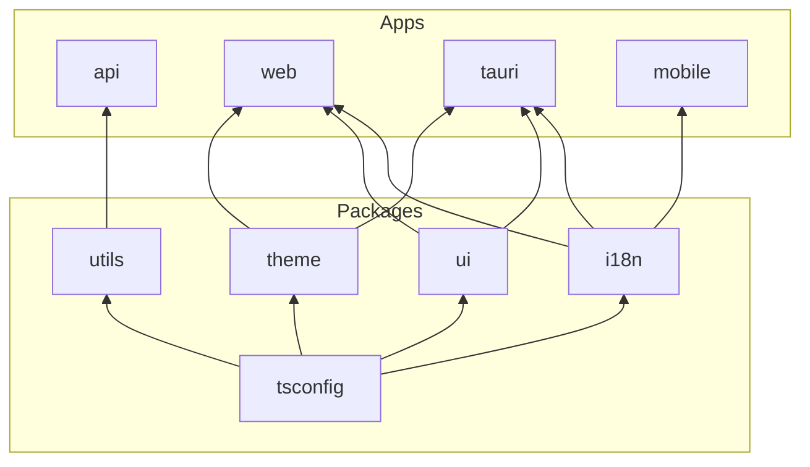

# Project Structure

## Apps

- [`@my-monorepo/api`](../apps/api) - Backend API built with Hono + tRPC.
- [`@my-monorepo/web`](../apps/web) - Web application built with TanStack Router + Vite.
- [`@my-monorepo/tauri`](../apps/tauri) - Desktop application built with Tauri v2.
- [`@my-monorepo/mobile`](../apps/mobile) - Mobile application built with Expo.

## Packages

- [`@my-monorepo/tsconfig`](../packages/tsconfig) - Shared TypeScript configurations.
- [`@my-monorepo/utils`](../packages/utils) - Shared utilities (zod, lodash, validator).
- [`@my-monorepo/i18n`](../packages/i18n) - Internationalization with i18next.
- [`@my-monorepo/ui`](../packages/ui) - UI components with shadcn/ui + Tailwind CSS.
- [`@my-monorepo/theme`](../packages/theme) - Theme management (light/dark/system).

## Dependency Graph

> All packages depend on `tsconfig`. Apps use `api` as devDependency for type inference.