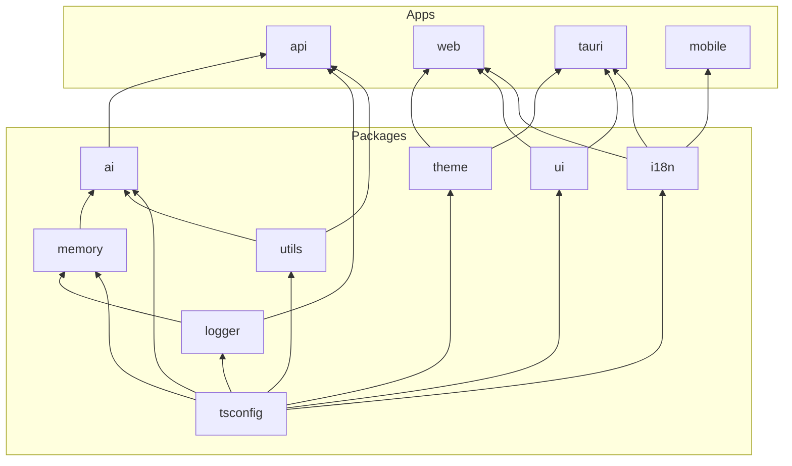

# Project Structure

## Apps

- [`@my-monorepo/api`](../apps/api) - Node.js runtime API using Hono + tRPC, with shared AI/logging/utilities. Dev server via `tsx watch`.
- [`@my-monorepo/web`](../apps/web) - React app built with TanStack Router/React Query/TanStack Start on Vite.
- [`@my-monorepo/tauri`](../apps/tauri) - Tauri v2 desktop app (Rust core) with a React + Vite frontend.
- [`@my-monorepo/mobile`](../apps/mobile) - Expo (React Native) app using Expo Router.

## Packages

- [`@my-monorepo/tsconfig`](../packages/tsconfig) - Shared TypeScript base configs (base, hono, react-app, react-library).
- [`@my-monorepo/utils`](../packages/utils) - Cross-app helpers for crypto/format/validation and shared libs (zod, validator, date-fns, superjson, jose, etc.).
- [`@my-monorepo/i18n`](../packages/i18n) - i18next setup with locale bundles and React hooks.
- [`@my-monorepo/ui`](../packages/ui) - Shared UI components/styles (shadcn/ui, Radix, Tailwind, CVA/clsx).
- [`@my-monorepo/theme`](../packages/theme) - Theme provider + helpers for light/dark/system.
- [`@my-monorepo/logger`](../packages/logger) - Pino-based logger with contextual helpers.
- [`@my-monorepo/ai`](../packages/ai) - AI SDK wrapper (ai-sdk + OpenAI-compatible provider) with resumable streaming support.
- [`@my-monorepo/memory`](../packages/memory) - Redis-backed memory/context store used by the AI package for resumable streams.

## Dependency Graph

> All packages depend on `tsconfig`. Apps use `api` as a devDependency for tRPC type inference.