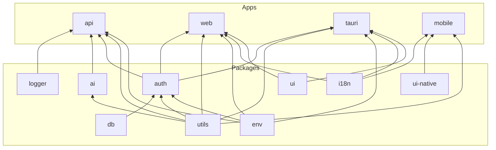

# Project Structure

## Apps

- [`@my-monorepo/api`](../apps/api) - Bun runtime API using Hono + tRPC, with shared AI/auth/env/logging/utilities. Dev server via `bun --watch`.
- [`@my-monorepo/web`](../apps/web) - React app built with TanStack Router/React Query/TanStack Start on Vite.
- [`@my-monorepo/tauri`](../apps/tauri) - Tauri v2 desktop app (Rust core) with a React + Vite frontend.
- [`@my-monorepo/mobile`](../apps/mobile) - Expo (React Native) app using Expo Router, NativeWind, and tRPC.

## Packages

- [`@my-monorepo/tsconfig`](../packages/tsconfig) - Shared TypeScript base configs (base, hono, react-app, react-library).
- [`@my-monorepo/utils`](../packages/utils) - Cross-app helpers for crypto/format/validation and shared libs (zod, validator, date-fns, superjson, jose, etc.).
- [`@my-monorepo/env`](../packages/env) - Type-safe environment variable validation using Zod.
- [`@my-monorepo/i18n`](../packages/i18n) - i18next setup with locale bundles and React hooks.
- [`@my-monorepo/ui`](../packages/ui) - Shared UI components/styles for web (shadcn/ui, Radix, Tailwind, CVA/clsx).
- [`@my-monorepo/ui-native`](../packages/ui-native) - Shared React Native UI components (React Native Reusables, NativeWind, CVA/clsx).
- [`@my-monorepo/logger`](../packages/logger) - Pino-based logger with contextual helpers.
- [`@my-monorepo/auth`](../packages/auth) - Authentication layer using better-auth with Prisma adapter.
- [`@my-monorepo/db`](../packages/db) - Prisma client wrapper for database access.
- [`@my-monorepo/ai`](../packages/ai) - AI SDK wrapper (ai-sdk + OpenAI-compatible provider).

## Dependency Graph

```mermaid
graph BT
    subgraph Packages
        UTILS[utils]
        ENV[env]
        I18N[i18n]
        UI[ui]
        UI_NATIVE[ui-native]
        LOGGER[logger]
        DB[db]
        AUTH[auth]
        AI[ai]
    end

    subgraph Apps
        API[api]
        WEB[web]
        TAURI[tauri]
        MOBILE[mobile]
    end

    %% package → package
    DB --> AUTH
    UTILS --> AUTH & AI
    ENV --> AUTH

    %% packages → API
    LOGGER & AI --> API
    AUTH --> API & WEB & TAURI
    UTILS & ENV --> API & WEB & TAURI

    %% packages → WEB / TAURI / MOBILE
    I18N & UI --> WEB & TAURI
    I18N & UI_NATIVE & UTILS --> MOBILE
```

> All packages depend on `tsconfig` (omitted for clarity). Apps use `api` as a devDependency for tRPC type inference. `mobile` uses `better-auth` directly (via `@better-auth/expo`) instead of `@my-monorepo/auth` due to the Prisma adapter being server-only.